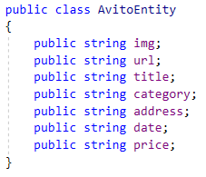

Html.Template.Finder library (C#, .NET Standard)
===

It enables you to parse web sites or any other XML-based content with a predefined template.

<details>
  <summary>Click here to expand...</summary>
  
  
  <br/>
  
</details>

Basics
---
The finder **HtmlXPathTemplateFinder** is based on XPath selectors and uses *HtmlAgilityPack* library under the hood.

All you need is to provide three things
- an html content (*string*)
- a template reader (*IHtmlTemplateReader&lt;HtmlXPathTemplate&gt;*)
- an entity type (any *class/struct* with a few *string* properties)

Template format
---
The default reader **HtmlXPathTemplateReader** supports custom XPath-based templates like
```
//*[@class='row']
    .//*[@row-type='photo']
        .//img[@src=$img]
    .//*[@row-type='title']
        .//a[@href=$url]/$title
    .//*[@row-type='price']
        .//span/$price
    .//*[@row-type='date']/$date
```
The XPath format can't be changed while you are using **HtmlXPathTemplateFinder**.

But you can change all other stuff by implementing your own template reader based on **IHtmlTemplateReader&lt;out TTemplate&gt;**

For example, it could be *JSON* format like
```
{
  "RootNodeXPath": "//*[@class='row']",
  "Patterns": [
    {
      "XPathSelector": ".//*[@row-type='photo']"
      "Children": [ { "XPathSelector": ".//img[@src=$img]" } ]
    },
    ...
  ]
}
```
There are two variable types in the template
- attribute variable
- innerText variable

You can set multiple attribute variables in a single XPath selector
```
.//a[@href=$url and @title=$title]
```
innerText variable grabs all the text inside the specified tag and can be combined with attribute variables in a single XPath selector

```
    ...
        .//a[@href=$url]/$title
    .//*[@row-type='price']
        .//span/$price
    .//*[@row-type='date']/$date
    ...
```
Just keep in mind
- all of them are removed once template is read
- the format is parsed by regex

<details>
  <summary>Click here to expand...</summary>
  
  
  <br/>
  
</details>

Code examples
---




[AvitoHtmlXPathTemplateFinderFixture.cs](src/Html.XPath.Template.Finder.Tests/Avito/AvitoHtmlXPathTemplateFinderFixture.cs)

References
---

* [HtmlAgilityPack](https://github.com/zzzprojects/html-agility-pack) library
    * [MIT License](https://github.com/zzzprojects/html-agility-pack/blob/master/LICENSE)

Disclaimer
---

* Developed for educational purposes only
* avito<i></i>.ru/e-katalog<i></i>.ru/market.yandex<i></i>.ru websites are used as a few examples only
    * Don't forget to check their policies
        * https://www.avito.ru/info/polzovatelskoe_soglashenie
        * https://yandex.ru/legal/market_termsofuse/?target=terms-of-use